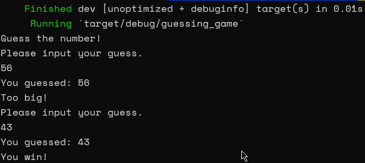
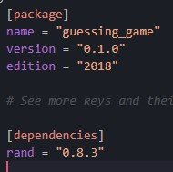

# Welcome to the Guessing Game In Rust

## By The Rust Foundation and replied by Johan Sebastian Puentes

### This is a repository of my learning about the rust language, possibly as I progress I find myself with more features to add and boxes to include in the project, even so it is possible to group it with other repositories and projects related to Rust, the game is simple, the machine chooses a random number and you have to guess it by writing your numbers in the input, **It should be noted that the numbers can only go from 1 to 100, as if to make it more fair and less overwhelming to play and to make the development less overwhelming**

## Documentation In: [The Rust Language]("https://doc.rust-lang.org/book/")
### Many thanks to the Rust Foundation for sharing their information and making rust a very attractive language and too easy to understand, I think that The Rust Progamming Language Ebook is very well done and represents a revolutionary language

## Dependencies

## **Run** And **Build The Binary**
´´´
$ Git Clone https://github.com/SebastianPuentesPulido/Guessing_Game_Rust.git
$ cd guessing_game_rust
$ Cargo Run
´´´
**OR**
´´´
$ Git Clone https://github.com/SebastianPuentesPulido/Guessing_Game_Rust.git
$ cd guessing_game_rust
$ cargo Build
´´´

